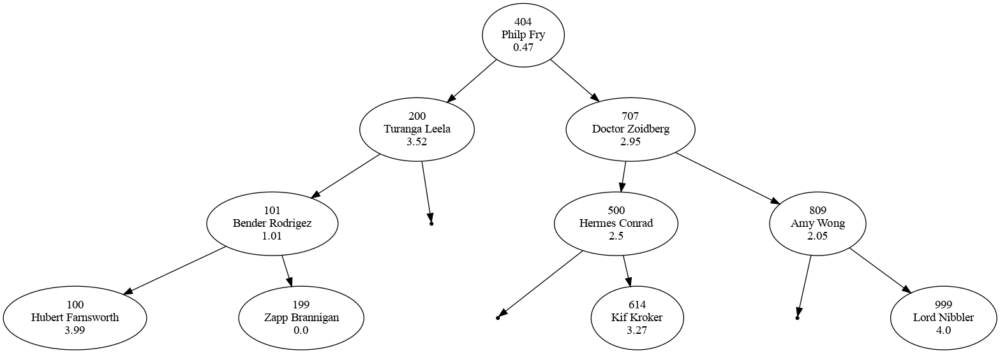
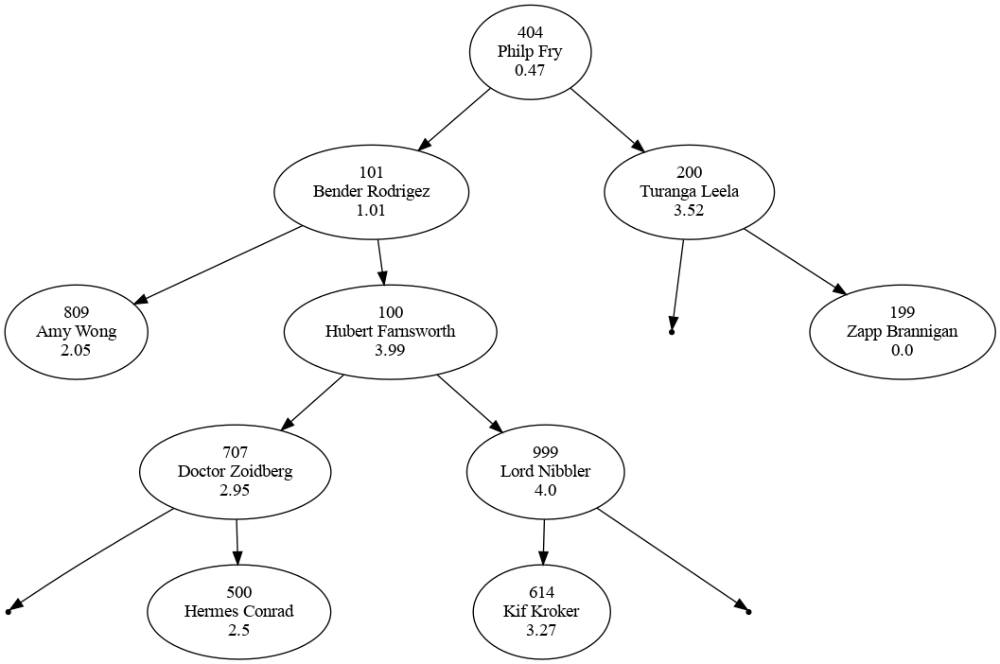
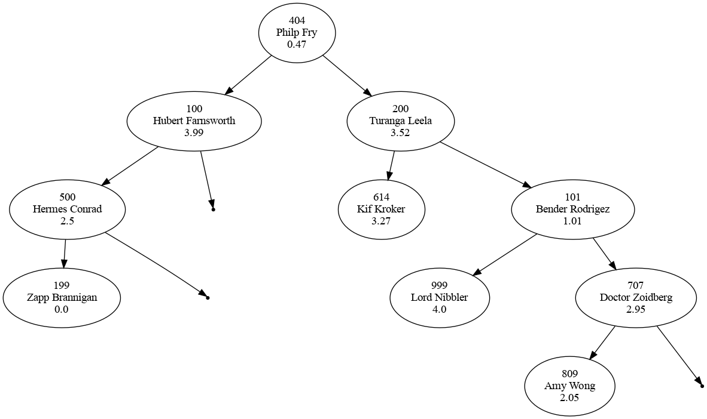
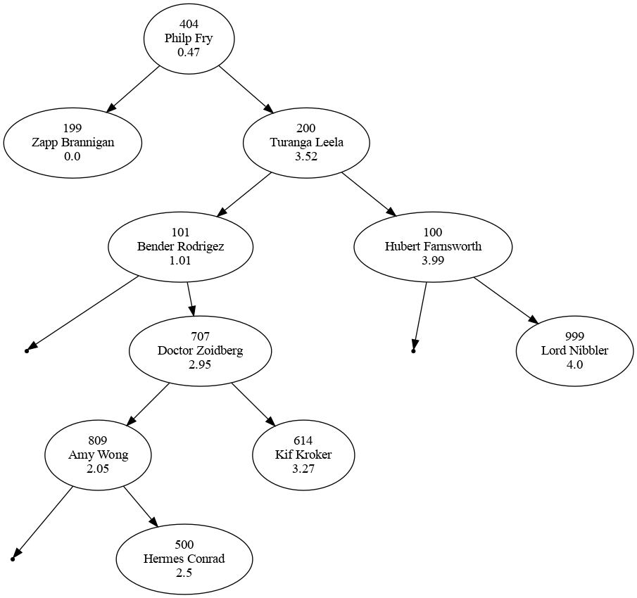

# Proje 6 (Ogrenci Ikili Arama Agaci)

[Proje 6 Github Classroom Davet Linki]([https://classroom.github.com/a/TfLcRNa5](https://classroom.github.com/a/0SmddpBg))

**Son Gonderim (Commit) Tarihi: 29 Mayis 2022 23:59**

* Bu projede ogrenci bilgileri (isim, soyisim, numara, not ortalamasi) ikili arama agacinda belirlenen anahtara gore saklanmaktadir.
* Anahtar degeri isim, soyisim, numara veya not ortalamasi olabilmektedir. Projedeki tum Java kodlarini inceleyiniz ve yorumlari dikkatle
  okuyunuz. Bu projede `BST.java` dosyasindaki icleri doldurulmamis 
  * `insertNameOrdered` 
  * `insertSurnameOrdered` 
  * `insertIDOrdered` 
  * `insertGPAOrdered`  
  * `getOrderedStudents`

metodlarinin iclerini sizin doldurmaniz beklenmektedir. Bu metodlari yazarken `BST` ve diger siniflardaki metodlarda ve sinif degiskenlerinde
degisiklik yapmayiniz. Bu metodlari yazmak icin ihtiyac duymaniz halinde `BST` sinifi icinde yeni metod, fonksiyon ve sinif degiskenleri tanimlayabilirsiniz.

* Bu projede olusturacaginiz ikili arama agaclarini gorsel olarak gorebilmeniz icin bu agaclardan dot dosyasi ureten ve bu dot dosyalarindan da agac resmi
  ureten kodlar verilmistir. Main altinda yorum satirina donusturulmus bolgeyi yorum olmaktan cikarir ve bu kodda gerekli olabilecek ufak duzenlemeleri 
  yaparsaniz Main altinda olusturacaginiz ikili arama agaclarina karsilik gelen agaclari gorsel (resim) olarak gorebilirsiniz. Dot 
  dosyalarindan resim dosyasi olusturabilmeniz icin bilgisayarinizda [Graphviz](https://graphviz.org/) kutuphanesi kurulu olmalidir. Bu projeyi tamamlayabilmeniz
  icin bilgisayariniza Graphviz kurmaniz ve ikili aramam agaclarinizdan resim dosyasi uretmeniz gerekmemektedir. `BST` sinifi icindeki `toDot` `toDotFile`
  metodlari ve bu metodlari kullanan yoruma cevrilmis Main kod blogu olusturdugu ikili arama agaclarini gorsel olarak gormek isteyen ogrencilere kolaylik 
  saglamak adina verilmistir. Proje icinde goreceginiz `tree1.dot` `tree2.dot` `tree3.dot` `tree4.dot` dosyalari Main altinda olusturulan agaclara ait
  dot dosyalaridir. Projenizdeki bu dosyalari silebilir veya uzerinde degisiklik yapabilirsiniz. 
  
 * Projeye baslamadan String sinifinin compareTo metodunu ve ikili arama agaclarinda anahtar kavramini arastiriniz. 
 
## Uyarilar

* Projenizdeki `Student.java` ve `BSTNode.java` dosyalari uzerinde herhangi bir degisiklik yapmayiniz.
* Yeni bir java uzantili kaynak dosyasi olusturmayiniz.
* Github'a yukleyeceginiz kodun derlendiginden emin olunuz. Derlenmeyen kodlar 0 puan alacaktir!
* Aksi belirtilmedikce mumkun oldugunca hazir siniflar (ArrayList gibi) kullanmaktan kacininiz.

## Kodun derlenmesi

```javac BSTNode.java Student.java BST.java Main.java```

## Kodun calistirilmasi

```java Main```

## Program ciktisi

Main.java uzerinde degisiklik yapilmazsa ve sizin doldurmaniz beklenen metodlar dogru sekilde doldurulursa programi calistirdiginizda alacaginiz cikti
asagidaki gibi olacaktir.

```
Printing tree1 object:

Name           Surname        ID          GPA 
Hubert         Farnsworth     100         3.99
Bender         Rodrigez       101         1.01
Zapp           Brannigan      199         0.00
Turanga        Leela          200         3.52
Philp          Fry            404         0.47
Hermes         Conrad         500         2.50
Kif            Kroker         614         3.27
Doctor         Zoidberg       707         2.95
Amy            Wong           809         2.05
Lord           Nibbler        999         4.00

Printing tree2 object:

Name           Surname        ID          GPA 
Amy            Wong           809         2.05
Bender         Rodrigez       101         1.01
Doctor         Zoidberg       707         2.95
Hermes         Conrad         500         2.50
Hubert         Farnsworth     100         3.99
Kif            Kroker         614         3.27
Lord           Nibbler        999         4.00
Philp          Fry            404         0.47
Turanga        Leela          200         3.52
Zapp           Brannigan      199         0.00

Printing tree3 object:

Name           Surname        ID          GPA 
Zapp           Brannigan      199         0.00
Hermes         Conrad         500         2.50
Hubert         Farnsworth     100         3.99
Philp          Fry            404         0.47
Kif            Kroker         614         3.27
Turanga        Leela          200         3.52
Lord           Nibbler        999         4.00
Bender         Rodrigez       101         1.01
Amy            Wong           809         2.05
Doctor         Zoidberg       707         2.95

Printing tree4 object:

Name           Surname        ID          GPA 
Zapp           Brannigan      199         0.00
Philp          Fry            404         0.47
Bender         Rodrigez       101         1.01
Amy            Wong           809         2.05
Hermes         Conrad         500         2.50
Doctor         Zoidberg       707         2.95
Kif            Kroker         614         3.27
Turanga        Leela          200         3.52
Hubert         Farnsworth     100         3.99
Lord           Nibbler        999         4.00

```

###### `Main.java` altindaki tree1 isimli objede temsil edilen ikili arama agaci



###### `Main.java` altindaki tree2 isimli objede temsil edilen ikili arama agaci



###### `Main.java` altindaki tree3 isimli objede temsil edilen ikili arama agaci



###### `Main.java` altindaki tree4 isimli objede temsil edilen ikili arama agaci



## Proje Kodlari

Bu proje icin size verilen kodlari asagida gorebilirsiniz.

* `Student.java`

```java
public class Student {
    private int ID;
    private String name;
    private String surname;
    private double GPA;

    public Student(int ID, String name, String surname, double GPA){
        this.ID = ID;
        this.name = name;
        this.surname = surname;
        this.GPA = GPA;
    }

    // Bu metod BST sinifindaki toDOT metodunda kullanilmaktadir.
    
    public String toDotString(){
        return "\"" + ID + "\\n" + name + " " + surname + "\\n" + GPA + "\"";
    }

    public int getID() {
        return ID;
    }

    public String getName(){
        return name;
    }

    public String getSurname(){
        return surname;
    }

    public double getGPA(){
        return GPA;
    }
}
```

* `BSTNode.java`

```java
public class BSTNode {
    public Student data;
    public BSTNode left;
    public BSTNode right;

    public BSTNode(){
    }

    public BSTNode(Student s){
        data   = s;
        left  = null;
        right = null;
    }
}
```


* `BST.java`

```java
import java.io.PrintWriter;

public class BST {
    private BSTNode root;
    private String keyType;
    private static int counter = 0;

    public BST(BSTNode node, String keyType){
        root = node;
        this.keyType = keyType;
    }

    public BST(String keyType){
        this(null,keyType);
    }

    public BST(){
        this(null, "ID");
    }

    // Bu metod agacta saklanan ogrencileri agacta kullanilan anahtar degerini gore
    // Student dizisi olarak dondurur. Bu metodu yazmak icin gerek duyarsaniz bu sinif
    // icinde yeni metodlar, fonksiyonlar ve sinif degisikenleri tanimlayabilirsiniz ama
    // mevcut sinif metodlari ve degiskenleri uzerinde bir degisiklik yapmayiniz.
    // Eger ikili arama agaciniz anahtar degeri GPA (not ortalamasi) ise bu metodun
    // dondurecegin dizinin ilk elemanindaki ogrenci not ortalamasi en dusuk son elemanindaki
    // ogrenci not ortalamasi en yuksek ogrenci olmalidir. Bir baska deyisle dondurulen
    // dizideki elemanlar anahtar degerine gore kucukten buyuge sirali olmalidir.

    // Bu metod bir altta tanimlanan PrintOrderedStudentsTable metodu tarafindan kullanilmaktadir.

    public Student[] getOrderedStudents(){
      // Metodun icini uygun sekilde doldurunuz.
    }

    // Bu metod agactaki ogrencilere ait bilgileri tablo olarak ekrana yazdirmaktadir.
    // Tablodaki ogrenciler agacta anahtar olarak belirlenen niteligi gore sirali
    // olarak yazdirilmaktadir. Ornegin ikili arama agaciniz anahtari ID (ogrenci numarasi)
    // olarak belirlendiyse bu metodu kullanarak agacinizdaki ogrencileri tablo olarak ekrana
    // yazdirmak isterseniz tablonun en ust satirinda ogrenci numarasi en kucuk ogrencinin; tablonun
    // en alt satirinda ise ogrenci numarasi en buyuk ogrencinin bilgilerini goreceksiniz.

    public void printOrderedStudentsTable(){
        System.out.format("%-15s%-15s%-12s%-4s\n", "Name", "Surname", "ID", "GPA");
        Student[] students = getOrderedStudents();
        for (Student s: students){
            System.out.format("%-15s%-15s%-12d%.2f\n",
                    s.getName(), s.getSurname(), s.getID(), s.getGPA());
        }
        System.out.println();
    }

    // Bu metod agaci gorsellestirmek icin kullanmaktadir.
    // Metod icindeki kodlari incelemeniz tavsiye edilir ama zorunlu degildir.

    public void toDotFile(String filepath) throws Exception{
        String allRules = toDot(root, "");
        String dotFileContent = "strict digraph BST{\n\tnodesep=1.5;\n\tranksep=0.5" + allRules + "\n}";

        PrintWriter writer = new PrintWriter(filepath, "UTF-8");
        writer.print(dotFileContent);
        writer.close();
    }

    // Bu metod agaci gorsellestirmek icin kullanmaktadir.
    // Metod icindeki kodlari incelemeniz tavsiye edilir ama zorunlu degildir.

    public String toDot(BSTNode node, String rules){
        if (node == null){
            return rules;
        }

        if ((node.left == null) && (node.right != null)){
            counter++;
            String newRulePrefix = "\tnull" + counter + " [shape=point];\n";
            String newRule = "\t" + node.data.toDotString() + " -> " + "null" + counter + ";";
            rules = rules + "\n" + newRulePrefix + newRule;
        }

        if (node.left != null){
            String newRule = "\t" + node.data.toDotString() + " -> " + node.left.data.toDotString() + ";";
            rules = rules + "\n" + newRule;
        }
        if (node.right != null){
            String newRule = "\t" + node.data.toDotString() + " -> " + node.right.data.toDotString() + ";";
            rules = rules + "\n" + newRule;
        }

        if ((node.right == null) && (node.left != null)){
            counter++;
            String newRulePrefix = "\tnull" + counter + " [shape=point];\n";
            String newRule = "\t" + node.data.toDotString() + " -> " + "null" + counter + ";";
            rules = rules + "\n" + newRulePrefix + newRule;
        }

        String leftRules  = toDot(node.left, "");
        String rightRules = toDot(node.right, "");
        rules = rules + leftRules + rightRules;
        return rules;
    }


    public BSTNode insert(Student[] students){
        BSTNode ret = null;
        for (Student s : students){
            ret = insert(s);
        }
        return ret;
    }

    // Insert metodu ikili arama agacina anahtar olarak belirlenen veriye
    // gore agaca yeni eleman yerlestirmektedir.

    public BSTNode insert(Student s){
        if (keyType == "name"){
            return insertNameOrdered(s);
        }
        if (keyType == "surname"){
            return insertSurnameOrdered(s);
        }
        if (keyType == "GPA"){
            return insertGPAOrdered(s);
        }
        return insertIDOrdered(s);
    }


    // Bu metod agacin anahtar olarak ogrenci ismi secilmesi durumunda kullanilacaktir.
    // Bu metod kullanilarak ikili arama agacina eklenen bir ogrenci agaca ogrenci ismi
    // baz alinarak eklenecektir. Bu metodu yazabilmek icin String kutuphanesinin compareTo
    // metodunu kullanmaniz gerekmektedir.

    private BSTNode insertNameOrdered(Student s){
        // Metodun icini uygun sekilde doldurunuz.
    }

    // Bu metod agacin anahtar olarak ogrenci soyismi secilmesi durumunda kullanilacaktir.
    // Bu metod kullanilarak ikili arama agacina eklenen bir ogrenci agaca ogrenci soyismi
    // baz alinarak eklenecektir. Bu metodu yazabilmek icin String kutuphanesinin compareTo
    // metodunu kullanmaniz gerekmektedir.

    private BSTNode insertSurnameOrdered(Student s){
        // Metodun icini uygun sekilde doldurunuz.
    }

    // Bu metod agacin anahtar olarak ogrenci not ortalamasi (GPA) secilmesi durumunda kullanilacaktir.
    // Bu metod kullanilarak ikili arama agacina eklenen bir ogrenci agaca ogrenci not ortalamasi
    // baz alinarak eklenecektir.

    private BSTNode insertGPAOrdered(Student s){
        // Metodun icini uygun sekilde doldurunuz.
    }

    // Bu metod agacin anahtar olarak ogrenci not numarasi (ID) secilmesi durumunda kullanilacaktir.
    // Bu metod kullanilarak ikili arama agacina eklenen bir ogrenci agaca ogrenci numarasi
    // baz alinarak eklenecektir.

    private BSTNode insertIDOrdered(Student s){
        // Metodun icini uygun sekilde doldurunuz.
    }
    
    // Bu metod Main fonksiyonu icinde olusturulan agaclarda saklanan ogrencilerin hangi cizgi dizinin
    // karakteri oldugunu kucuk harflerle ekrana yazdirir. Ipucu:
    // Bu metod 8 karakterli bir string dondurecek sekilde degistirilmelidir.
    // Bu metoddan proje aciklamalarinda bahsedilmemektedir.
    public String bonus(){
        return "";
    }

}
```

* `Main.java`

```java
public class Main {
    public static Student[] generateStudents(){
        Student fry = new Student(404, "Philp", "Fry", 0.47);
        Student lila = new Student(200, "Turanga", "Leela", 3.52);
        Student bender = new Student(101, "Bender", "Rodrigez", 1.01);
        Student prof = new Student(100, "Hubert", "Farnsworth", 3.99);
        Student zoid = new Student(707, "Doctor", "Zoidberg", 2.95);
        Student amy = new Student(809, "Amy", "Wong", 2.05);
        Student nibbler = new Student(999, "Lord", "Nibbler", 4.00);
        Student hermes = new Student(500, "Hermes", "Conrad", 2.50);
        Student kif = new Student(614, "Kif", "Kroker", 3.27);
        Student zap = new Student(199, "Zapp", "Brannigan", 0.00);

        Student[] students = new Student[]{fry, lila, bender, prof, zoid, amy, nibbler, hermes, kif, zap};
        return students;
    }

    public static void main(String args[]) throws Exception {
        BST tree1 = new BST("ID");
        BST tree2 = new BST("name");
        BST tree3 = new BST("surname");
        BST tree4 = new BST("GPA");

        tree1.insert(generateStudents());
        tree2.insert(generateStudents());
        tree3.insert(generateStudents());
        tree4.insert(generateStudents());

        System.out.println("Printing tree1 object:");
        System.out.println();
        tree1.printOrderedStudentsTable();

        System.out.println("Printing tree2 object:");
        System.out.println();
        tree2.printOrderedStudentsTable();

        System.out.println("Printing tree3 object:");
        System.out.println();
        tree3.printOrderedStudentsTable();

        System.out.println("Printing tree4 object:");
        System.out.println();
        tree4.printOrderedStudentsTable();

        // Asagidaki yorum satirina cevrilmis kodlar olusturdugumuz her bir agac objesi
        // icin o agaci temsil eden resim dosyasi olusturmaktadir. Bu kodlarin
        // calisabilmesi icin Graphviz kutuphanesinin (https://graphviz.org/) bilgisayariniza
        // dogru bir sekilde yuklenmis olmasi gerekmektedir. Asagidaki kodlar ve BST sinifi
        // icindeki toDot ve toDotFile metodlari bu proje icin olusturacaginiz agaclari
        // gorsel olarak daha kolay gozunuzde canlandirabilmenize yardimci olabilmek icin verilmistir.
        // Bu projeyi tamamlayabilmeniz icin bu kodlari anlamaya calismaniz gerekmemektedir.

        /*
        tree1.toDotFile("tree1.dot");
        tree2.toDotFile("tree2.dot");
        tree3.toDotFile("tree3.dot");
        tree4.toDotFile("tree4.dot");
        String cmd = "dot tree1.dot -Tpng -o tree1.png";
        Runtime run = Runtime.getRuntime();
        Process pr = run.exec(cmd);
        cmd = "dot tree2.dot -Tpng -o tree2.png";
        run = Runtime.getRuntime();
        pr = run.exec(cmd);
        cmd = "dot tree3.dot -Tpng -o tree3.png";
        run = Runtime.getRuntime();
        pr = run.exec(cmd);
        cmd = "dot tree4.dot -Tpng -o tree4.png";
        run = Runtime.getRuntime();
        pr = run.exec(cmd);
        */
    }
}
```
